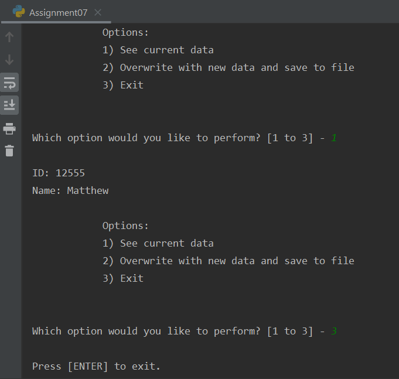
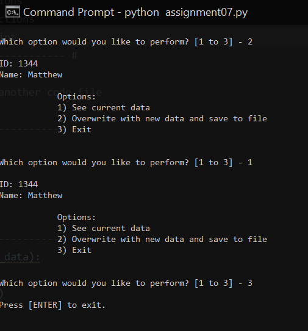

Matthew Kojetin  
06/01/20  
IT FDN 100 A  
Assignment 07  
https://github.com/matthewkojetin/IntroToProg-Python-Mod07  

# Module 07: Pickling and structured error handling
## Introduction
Pickling is another way to work with text files that allows you to save data objects in their original format, without special formatting and precise syntax. If you can anticipate the errors your user might encounter, you can provide human-readable error messages or mitigating code through the use of try/except error handling.

## Pickle
Pickle is a common serialization module that converts Python objects to bytestring (binary text file) and back again. You can import the pickle module using `import pickle`.

### Reading data from a binary file
A binary file is a non-secure text file that is only partially human readable, but can store data objects without needing to process them to a specific syntax.
To read content from a binary file use the `pickle.load()` function (Figure 1).
```python
objFile = open("AppData.dat", "rb+") # opens file in read+ mode
lstData = pickle.load(objFile) # loads data and stores to a list
objFile.close() # closes file
```
***Figure 1. Reading data from binary file using pickle module.***

### Writing data to a binary file
The `pickle.dump()` function takes the data from your script and "dumps" it to your file. The entire data object is saved, so you don't have to go through the work of looping through the data set and formatting (Figure 2).
```python
objFile = open("AppData.dat", "wb")
pickle.dump(lstData, objFile)
objFile.close()
```
***Figure 2. Writing data to binary file using pickle module.***
More information available in the [Official Python Pickling Documentation](https://docs.python.org/3/library/pickle.html "Official Python Pickling Documentation") (external site).

## Error handling (try-except)
This is a way to present the user of your script with a human-readable error code if you anticipate a point where the script could fail (Figure 3).
```python
try:
    x / y
except:
    print("Could not divide " + str(x) + " by " + str(y))
```
***Figure 3. Try/except error handling.***

Additionally you can create exceptions specific to certain errors (Figure 4).
```python
try:
    x = int(input("Please enter a number: "))
    break
except ValueError:
    print("Oops!  That was no valid number.  Try again...")
```
***Figure 4. Try/except with a named exception.***
More information available in the [Official Python Errors Documentation](https://docs.python.org/3/tutorial/errors.html "Official Python Errors Documentation") (external site).

## Assignment07 script
To complete this assignment I created a script that loads an ID and Name from a binary file,
 and gives you the option to overwrite the content of the file with a new ID and Name.

I started by creating a set of processing functions `save_data_to_file()` and `read_data_from_file()` that use the pickle module's dump and load functions respectively.

From there I created functions in my presentation block that allow me to print a menu, collect a menu choice, or collect user data.

In the main body of my script I started by loading data from file. If the file doesn't exist or doesn't contain data, an error is thrown. To prevent this I used try/except error handling to give a human-readable message if the file isn't present (Figure 5).
```python
try:
    lstCustomer = read_data_from_file(strFileName)
except:
    print("No existing data in file \"AppData.dat\"")
```
***Figure 5. Error handling.***

Then I use a `while(True)` loop to present the menu of options to the user until option 3 is selected. If options 1 or 2 are entered, the if/elif statements contain the appropriate IO and processing functions to complete the task selected.

The script runs in PyCharm (Figure 6).  
  
***Figure 6. Script running in PyCharm.***

The script runs in the Windows command prompt (Figure 7).  
  
***Figure 7. Script running in Windows command prompt.***

## Summary
Using the pickle module and structured error handling I was able to import code that makes it easier to save/write a data object to file, and ensure any expected errors are mitigated.
